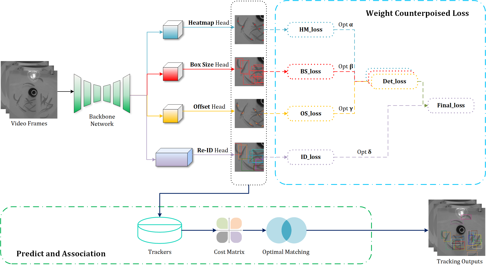
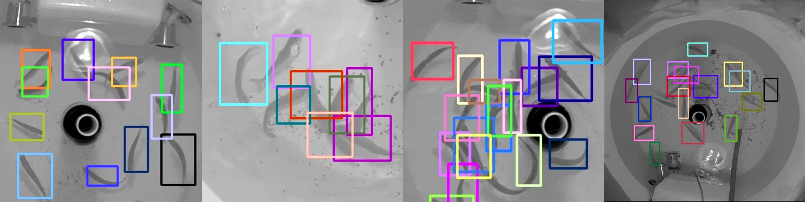
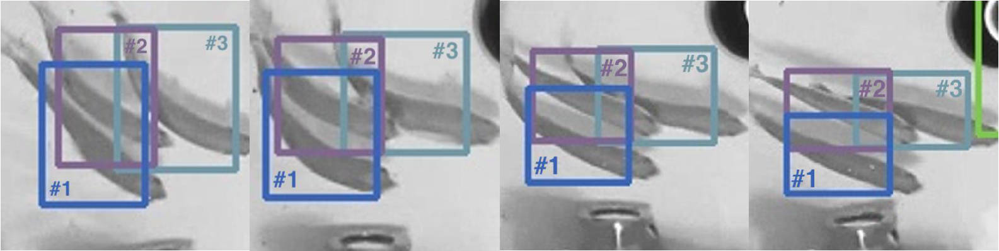
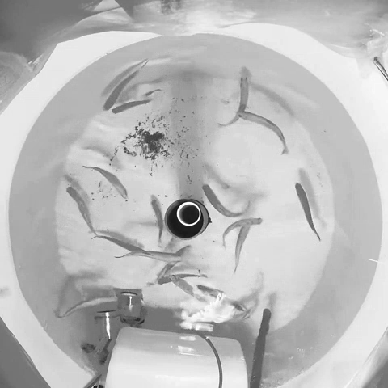
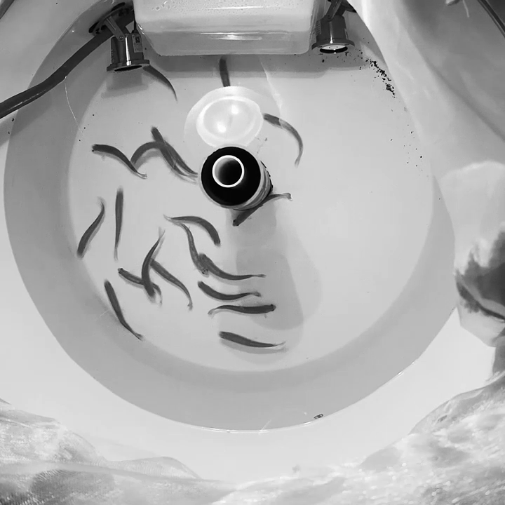

# CMFTNet: Multiple Fish Tracking Based on Counterpoised JointNet
The official implementation of the paper：
>  [**CMFTNet: Multiple Fish Tracking Based on Counterpoised JointNet**](https://doi.org/10.1016/j.compag.2022.107018)  
>  Weiran Li, Fei Li, Zhenbo Li  
>  [**\[Paper\]**](https://doi.org/10.1016/j.compag.2022.107018) [**\[Code\]**](https://github.com/vranlee/CMFTNet/)



Contact: vranlee@cau.edu.cn. Any questions or discussion are welcome!

-----

## Updates
+ [2021.05.08] We updated the sample official implementation of the [**CMFTNet**](https://github.com/vranlee/CMFTNet).
-----

## Tracking Result Samples



## Abstract
The analysis of fish motion is remarkably applied to investigate physiological behavior and water quality status. Multiple fish tracking methods based on computer vision have the advantages of contactless, information interpretability, single equipment, and high durability. However, the existed approaches cannot cope with complex scenarios, occlusions, and inconstant scales well. To solve the issues, we propose a multi-object video tracking model specifically for fish schools in aquaculture ponds, called CMFTNet. Firstly, we deploy the Joint Detection and Embedding paradigm to share the features for multiple fish detection and tracking tasks. It utilizes the anchor-free method to solve the problem of mutual occlusion of fish schools. Then, we embed the deformable convolution in the updated backbone to intensify the context features of fish in complex environments. Finally, we evaluate the influence of feature dimensions and propose a weight counterpoised loss that outperforms the previous aggregation methods on dual-branch. Extensive experiments show that CMFTNet achieves the best result both on precision and efficiency. The model reaches 65.5% MOTA and 27.4% IDF1 on the OptMFT dataset.

## Contributions
+  We design a Counterpoised Multiple Fish Tracking Network named CMFTNet. Compared with the TBD-based methods, our JDE-type network gets 1.3 times training efficiency improvement in multi-fish tracking. Considering the non-rigid feature of the fish target, we utilize the Deformable Convolutional Network (DCN) combined with ResNet-101 as our backbone, which achieves better performance compared to other networks.
+  The weight counterpoised loss is proposed to fuse the feature extraction branches better, which adjusts the proportion of the effect of subtasks on the fish target. The four various sub-branches are designed to extract fish centers, bounding boxes, offsets, and distinguishable features respectively.
+  The relationship between feature dimensions and tracking performance is investigated for fish targets. We find that lower dimensions (64 or 128) have better tracking performance when comprehensively assessing the impact of four feature extraction branches.
+  The experiments on OptMFT datasets shows that CMFTNet still maintains the outstanding retention capacity for fish instances under scale changes and occlusion issues, achieves 65.5% MOTA and 27.4% IDF1. Meanwhile, we perform transfer applications in other scenarios, verifying the strong generalizability of our model.


## Tracking performance

### Results on OptMFT & OptMFT_Light Dataset

Dataset  | MOTA ↑ |  IDF1 ↑  |
---------|------|-------|
OptMFT   | 65.5% | 27.4% |
OptMFT_light   | 71.4% | 38.6% |


### Datasets Samples

We provide some samples of our OptMFT & OptMFT_light dataset. The sample datasets can be download from: **[[Onedrive]](https://1drv.ms/u/s!AiAYwd6-_n-fmmDxKUh81f5nylZv?e=61bjeO) [[BaiduYun: hfg1]](https://pan.baidu.com/s/1-R3kyzkm8iNNKD7AIombNg)**

Class  | Sample |  Class  | Sample |  Class  | Sample |
---------|------|---------|--------|---------|--------|
   | Normal |  | Cruise |  | Disturb |
  |Feed |  | Spot |

## Installation
+ **Step.1** Clone this repo.
+ **Step.2** Install dependencies. We use **python 3.8.10** and **CUDA 10.2.89**.
   ```
   conda create -n CMFTNet
   conda activate CMFTNet
   conda install pytorch==1.7.0 torchvision==0.8.0 cudatoolkit=10.2 -c pytorch
   cd {Repo_ROOT}
   pip install -r requirements.txt
   ```
* **Step.3** Compile [**DCNv2_pytorch_1.7**](https://github.com/ifzhang/DCNv2/tree/pytorch_1.7).
   ```
   git clone -b pytorch_1.7 https://github.com/ifzhang/DCNv2.git
   cd DCNv2
   ./make.sh
   ```
* **Step.4** To visualize the tracking results, [**ffmpeg**](https://www.ffmpeg.org/) is also need to be installed.

## Baseline model
Our pretrained **CMFTNet** models can be downloaded here:   

+  **CMFTNet_OptMFT_light_60ep.pth: [[Onedrive]](https://1drv.ms/u/s!AiAYwd6-_n-fml-K9ROh0Yiw9MhJ?e=kZyvRP) [[BaiduYun: 8jgt]](https://pan.baidu.com/s/1cZXY4mXP5r8s62n0Rn_k_w)**  

+  **CMFTNet_OptMFT_60ep.pth: [[Onedrive]](https://1drv.ms/u/s!AiAYwd6-_n-fml6bRfI6qiQt57cu) [[BaiduYun: p41i]](https://pan.baidu.com/s/14WoiPJJrQXZAkd54qYp-Jg)**


## Data Preparation
+ Download the sample datasets here:  
**OptMFT_Samples.tar.gz: [[Onedrive]](https://1drv.ms/u/s!AiAYwd6-_n-fmmDxKUh81f5nylZv?e=61bjeO) [[BaiduYun: hfg1]](https://pan.baidu.com/s/1-R3kyzkm8iNNKD7AIombNg)**

+ Using the ***gen_data_path_sample.py*** to generate the training json files.

## Training
* Download or utilize your training datasets.
* Train on the **Sample Dataset**:
```
sh experiments/train.sh
```

## Tracking
* The default settings run tracking on the validation dataset from 2DMOT15. Using the baseline model, you can run:
* Track on the **Sample Dataset**:
```
sh experiments/track.sh
```

## Acknowledgement
A large part of the code is borrowed from [xingyizhou/CenterNet](https://github.com/xingyizhou/CenterNet) and [ifzhang/FairMOT](https://github.com/ifzhang/FairMOT). 
Thanks for their wonderful works!

## Citation
```
@article{LI2022107018,
title = {CMFTNet: Multiple fish tracking based on counterpoised JointNet},
journal = {Computers and Electronics in Agriculture},
volume = {198},
pages = {107018},
year = {2022},
issn = {0168-1699},
doi = {https://doi.org/10.1016/j.compag.2022.107018},
url = {https://www.sciencedirect.com/science/article/pii/S0168169922003350},
author = {Weiran Li and Fei Li and Zhenbo Li},
}
```